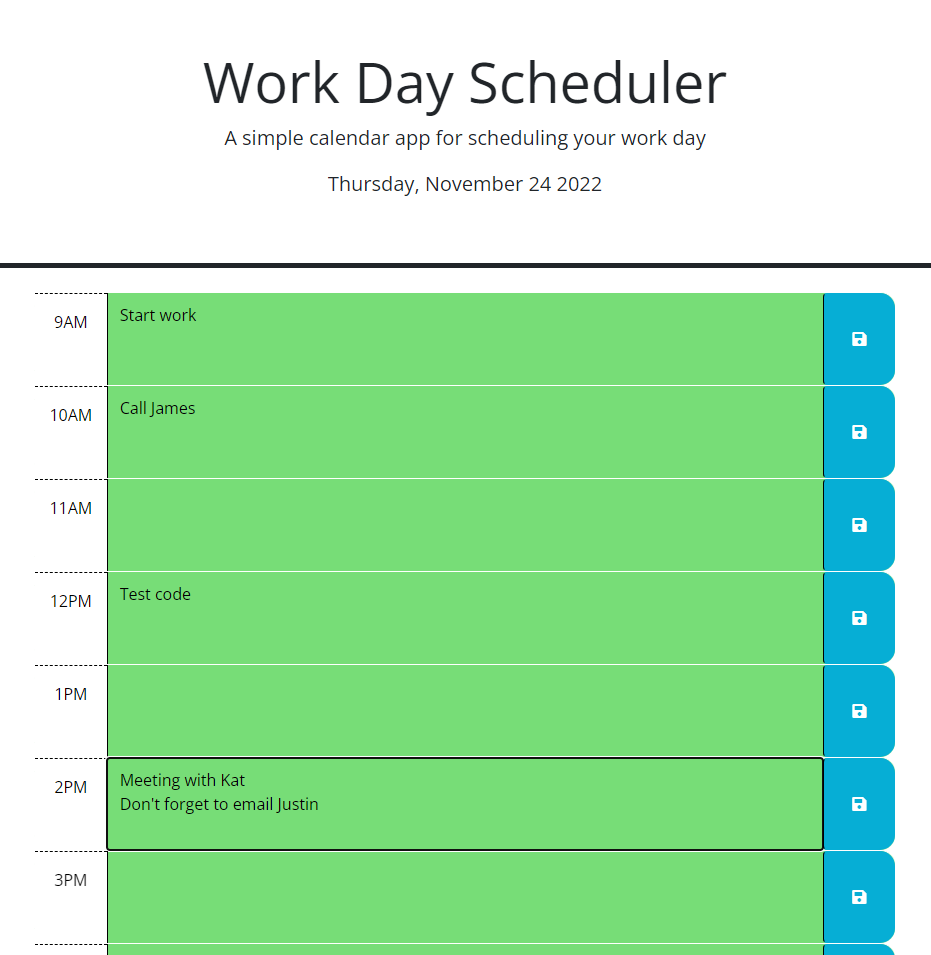

# Day Planner/Scheduler - Module 5 Challenge

##Description

A day planner to enter events to be done during the day and save it so that even if the page is reloaded, the information is still there. The time intervals are colour coded to indicate the present interval - orange, past intervals - grey, and future intervals - green.oter

##Usage

Simple was to plan one's schedule for the day

##Credits

JQuery
W3Schools
Stackoverflow

##Screenshot

 
##Link to deployed application

https://mdpais.github.io/Scheduler/

##License

None